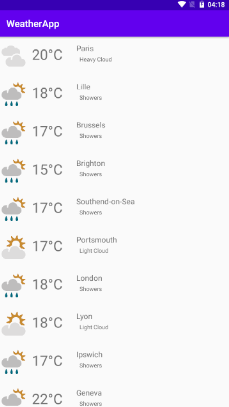
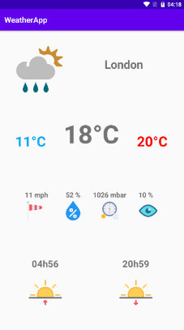
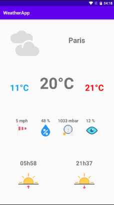

# Application WeatherApp

## Présentation

Petite application développé en java pour découvrir android studio.

Cette application affiche la météo des villes qui se situe autour de notre position. Pour cela elle utilise l'API metawheather.com.

## Prérequis


- Installation d'Android Studio
- Récupérer la branche master<br/>


````
https://github.com/Eythan99/WeatherApp
````

## Consignes respectées : 

- Clean Architecture & MVC
- Appels REST
- Ecrans : 2 activités
- Affichage d'une liste dans un RecyclerView
- Affichage du détail d'un item de la liste
- Stockage de donnée via SharedPreference
- Fonctions supplémentaires :
	- Récupération des coordonnées GPS de l'utilisateur
  - Plusieurs appels d'API
  - Design patern


## Fonctionnalités: 

### Ecran d'accueil 

- Sur le premier écran, l'utilisateur voit un récapitulatif des différentes villes au alentours avec à chaque fois la météo et la température.



### Ecran de détail d'une ville

- Affiche différentes informations sur la météo de la ville comme :
  - Les températures min, max et actuel
  - Les heures de levé et de couché du soleil
  - La pression atmospherique, l'humidité, la visibilité et la vitesse du vent
- Images illustrants chaque information

  
